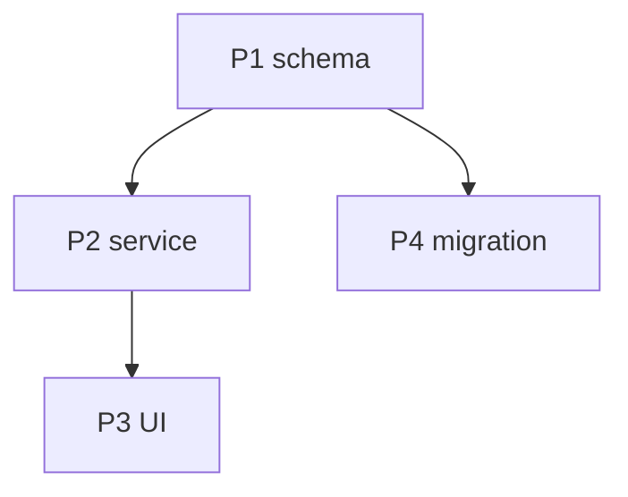

# The implementation map (`01-map.md`)

This is the artifact that makes the plan work. A list of tasks tells an executor *what to do*; the map tells it *what everything else is and how this task connects to it* — the context a small model can't hold but needs in order not to break things it can't see. Write the map so that opening it plus one task file is enough to execute that task safely.

Keep it scannable: an executor reloads the relevant slice of it constantly. Favor tables, short declarative lines, and an explicit graph over long prose.

## Structure

```markdown
# Implementation Map — <task name>

> **TL;DR:** One or two sentences: what's being built and the spine of the approach.

## Big picture
3–6 sentences. What this task delivers, the overall shape of the solution, and the
single mental model someone should hold. If there's a "north star" decision that
everything else follows from, state it here.

## The parts
The units of work and what each owns. One row each.

| Part | Responsibility | Lives in (path/area) | Status |
|------|----------------|----------------------|--------|
| P1 — <name> | what it's responsible for | where it is / will be | new / changed / existing |

## The connections
How the parts depend on and talk to each other. This is the section no single
executor can reconstruct alone — make it explicit.

| From | To | Connection (contract / data / event / call) | What must stay true |
|------|----|----|----|
| P2 | P1 | calls `P1.create(x)` and expects `{id}` back | the return shape; if P1 changes it, P2 breaks |

Then a dependency graph — a simple arrow list or Mermaid — so build order and
parallelizability are visible at a glance:



## Invariants & things to keep in mind
The cross-cutting rules that must hold across the WHOLE task, regardless of which
piece someone is in. Tag each so tasks can cite it (e.g. "honors INV-2").

- **INV-1** — <a rule that several parts must agree on; e.g. "all timestamps are UTC ISO-8601">
- **INV-2** — <a safety/order rule; e.g. "the migration in P4 must land before P2 reads the new column">
- **INV-3** — <a convention; e.g. "new endpoints follow the existing error envelope `{code,message,...}`">

## Risks & open questions
- **Risk** — <what could go wrong, and the mitigation baked into the plan>.
- **Open question** — <what's undecided; who/what resolves it, and which tasks it blocks>.
```

## How the map and tasks reinforce each other

- Each **part** maps to one or more tasks; each **task** names the part(s) it touches.
- Each **connection** is a tripwire: a task that changes the "From" side must check the "To" side still holds. Tasks reference the connection rows they affect.
- Each **invariant** is cited by every task it constrains, so the executor re-reads the rule exactly when it's about to matter — not as general background it'll forget.

The test of a good map: hand an executor any single task plus this file, and it has every cross-cutting fact it needs to do that task without breaking another. If it doesn't, the map is missing a connection or an invariant — add it.

## Keeping the map alive

The map is the project's memory, so it has to stay current as work lands. Note in
the README that an executor finishing a task updates the map if it changed a
contract or added a connection (and updates the affected `What must stay true`
cell). A stale map is worse than none — it tells the executor a connection is safe
when it isn't.
